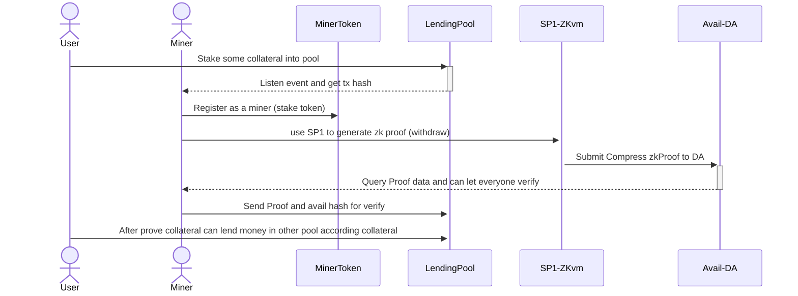

# Gohan Layer

## Using this example

Run the following command:

```sh
pnpm dlx create-turbo@latest
```

## What's inside?

This Turborepo includes the following packages/apps:

### Sequence Diagram


