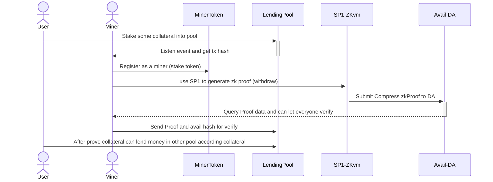

# 

<div align="center">
<h1>Gohan Layer</h1>
<p>A future proof generate reward system</p>
</img>

[](./LICENSE)
</div>

### Demo Page
- WebPage: [gohan-layer.page.dev](https://gohan-layer.pages.dev/)
- Contract Address
  + Base: https://sepolia.basescan.org/address/0x47f2b8e6483Cb8FCcd937d8bCC70390a5d334e77#code
  + Mantle: https://explorer.sepolia.mantle.xyz/address/0x47f2b8e6483Cb8FCcd937d8bCC70390a5d334e77#code
  + Polygon Cardona https://cardona-zkevm.polygonscan.com/address/0xe3a6b8Da8932354592E7F3f6199b82D6E2bdBDb2#code
  + OP Avail: https://op-avail-sepolia-explorer.alt.technology/address/0x8E42aB07232757CC0DA117d2846ff981E3eDCbdF#code
- Token Contract Address: [packages/contract/README.md](./packages/contract/README.md)


### Abstract
Gohan-Layer is a liquidity pool leveraging a Data Availability Layer (DA) to generate and validate transaction proofs.

- Problem Settlement:
  + **Lack of liquidity**: current DeFi solutions struggle with seamless operations across different layer 2.
  + **Lack of transparency**: Lots of people rely on Exchange to swap their token.
  + **High entry barriers in new chain**: New chain and learn new token.
- Soultion:
  + **Avail DA(Enhanced transparency )**: Using DA as our proof storage, everyone can verify it.
  + **SP1 ZKVM(Enhanced Safety)**: Use ZK to prove the actions on chain make it more secure.
  + **Lower Barriers**: miner will send money to your other chain account, it can be the chain expert in the fastest time!
   
### Build & Installation
| GohanLayer is a monorepo managed using `turbo`. You can find the source code for each package in the `apps` and `packages` directory.
- apps`
  + `apps/circuits` is the SP1 ZK circuits use for eigenlayer withdraw proof and also publish to DA
  + `apps/web` is the web frontend. It built by frontend template, `wagmi` and `vite`
- `packages`
  + `packages/contract` is the miner register contract and the test ERC20 token for test.

### Step By Step
1. Install all peer dependencies
```bash
pnpm install
```

2. Build only frontend
```bash
pnpm build --filter web
```

3. Deploy Contract
```bash
cd packages/contract
pnpm deploy:token --networks <YOUR_NETWORK>
pnpm deploy:miner --networks <YOUR_NETWORK>
```

4. Run the ZK Circuits
```bash
cd apps/circuits/script
cargo clean & cargo update
RUST_LOG=info cargo run --release
```
### Sequence Diagram


